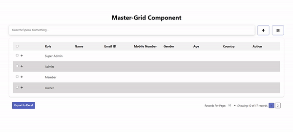

# ReactJS - Master-Grid Component

The React Grid component is a customizable and feature-rich data grid that allows you to display and manage tabular data efficiently. When a row in the Master Grid is expanded, a new Detail Grid appears underneath that row. It supports pagination, sorting, searching, and voice-based search for enhanced user experience. This component can be easily integrated into your React applications.

You can easily customize the component's appearance and behavior by using the provided props. The browser support includes modern versions of popular browsers, ensuring compatibility across various platforms.

## Table of contents

- [ReactJS - Master-Grid Component](#reactjs---master-grid-component)
  - [Table of contents](#table-of-contents)
  - [Browser Support](#browser-support)
  - [Demo](#demo)
  - [Getting started](#getting-started)
  - [Usage](#usage)
  - [API Response](#api-response)
  - [CSS](#css)
  - [Available Props](#available-props)
  - [SearchProps](#searchprops)
  - [VoiceSearchProps](#voicesearchprops)
  - [GridTableProps](#gridtableprops)
  - [ColumnProps](#columnprops)
  - [PaginationContainerProps](#paginationcontainerprops)
  - [ColumnVisibility](#columnvisibility)
  - [excelProps](#excelprops)
  - [Want to Contribute?](#want-to-contribute)
  - [Collection of Components](#collection-of-components)
  - [Changelog](#changelog)
  - [License](#license)
  - [Keywords](#keywords)

## Browser Support

|  |  |  |
| ---------------------------------------------------------------------------------------- | ---------------------------------------------------------------------------------- | ---------------------------------------------------------------------------------------------------------------------------- |
| 83.0 ✔                                                                                   | 83.0 ✔                                                                             | 11.9 ✔                                                                                                                       |

## Demo

[](https://github.com/weblineindia/ReactJS-Master-Grid/master_grid.gif)

## Getting started

Install the npm package:

```bash
npm install react-weblineindia-master-grid
#OR
yarn add react-weblineindia-master-grid
```

## Usage

Use the `<react-weblineindia-master-grid>` component:

```js
import { useEffect, useState } from "react";
import axios from "axios";
import { useGridContext } from "react-weblineindia-master-grid";
import Grid from "react-weblineindia-master-grid";

const App = () => {
   const { setColumnState, visibleColumns } = useGridContext();
  const [data, setData] = useState({});
  const [allData, setAllData] = useState([]);
  const [parameter, setParameter] = useState({
    page: 1,
    records: 10,
    searchQuery: "",
    sortColumn: "",
    sortOrder: "ASC",
  });
  const [editedData, setEditedData] = useState([]);

  useEffect(() => {
    //HERE, You can call your API...
    setColumnState(columnProps);
    getData();
  }, [parameter]);

  useEffect(() => {
    //HERE, You can call your API...
    getAllData();
  }, []);

  const getData = async () => {
    const response = await axios.get(
      `http://localhost:3000/master-grid?page=${parameter.page}&limit=${parameter.records}&search=${parameter.searchQuery}&sortField=${parameter.sortColumn}&sortOrder=${parameter.sortOrder}`
    );
    setData(response.data);
  };

  const getAllData = async () => {
    const response = await axios.get(`http://localhost:3000/master-grid/all`);
    setAllData(response.data);
  };

  const handlePageChange = (page) => {
    setParameter({ ...parameter, page: page });
  };

  // Dropdown change event for pagination
  const onDropdownChange = (records) => {
    setParameter({ ...parameter, records: records });
  };


  // Sorting
  const handleSort = (field) => {
    if (field !== "action") {
      if (field === parameter.sortColumn) {
        // Reverse the sort direction if the same column is clicked
        const order = parameter.sortOrder === "ASC" ? "DESC" : "ASC";
        setParameter({ ...parameter, sortOrder: order });
      } else {
        // Set the new sort column and default sort direction
        setParameter({ ...parameter, sortColumn: field, sortOrder: "ASC" });
      }
    }
  };

  // Searching
  const onSearch = (value) => {
    setParameter({ ...parameter, searchQuery: value });
  };
  // clear search Input
  const onClear = () => {
    onSearch('');
  };

  // Event for storing the searchQuery based on voice search
  const micHandlerForSearch = (value) => {
    setParameter((prevParameter) => ({
      ...prevParameter,
      searchQuery: value,
    }));
  };


  // Function to handle inline edit for child rows
  const handleEdit = (rowIndex, childIndex, columnKey, value) => {
    const updatedData = [...editedData];
    if (!updatedData[rowIndex]) {
      updatedData[rowIndex] = [];
    }
    if (!updatedData[rowIndex][childIndex]) {
      updatedData[rowIndex][childIndex] = {};
    }
    updatedData[rowIndex][childIndex][columnKey] = value;
    setEditedData(updatedData);
  };

  // Function to save the edited data back to the main data array
  const handleSave = (rowIndex, childIndex, data, columnKeys) => {
    const updatedData = [...data];
    const editedRowData = editedData[rowIndex]?.[childIndex];
    if (editedRowData) {
      columnKeys.forEach((columnKey) => {
        if (editedRowData.hasOwnProperty(columnKey.columnKey)) {
          updatedData[rowIndex].children[childIndex][columnKey.columnKey] =
            editedRowData[columnKey.columnKey];
        }
      });
    }
    setEditedData((prevEditedData) => {
      const updatedEditedData = [...prevEditedData];
      updatedEditedData[rowIndex][childIndex].edit = false;
      return updatedEditedData;
    });
  };

  // Function to cancel the edit and discard changes
  const handleCancelEdit = (rowIndex, childIndex) => {
    const updatedData = [...editedData];
    updatedData[rowIndex][childIndex].edit = false;
    setEditedData(updatedData);
  };


  const handleSelectCheckbox = (selectedData) => {
    console.log(selectedData)
  }

  const isSearch = true;
  const searchProps = {
    searchPlaceHolder: "Search/Speak Something...",
    searchBoxStyle: "search-box",
    searchInputDivStyle: "input-area",
    searchInputStyle: "search-input",
    clearButtonStyle: "clear-button",
    onSearch: onSearch,
    onClearBtn: onClear,
    parameter:parameter
  };

  const isVoiceSearch = true;
  const voiceSearchProps = {
    micIconStyle: "mic-icon",
    popupContentStyle: "large-mic",
    micHandlerForSearch: micHandlerForSearch
  };

  const gridTableProps = {
    data: data?.data,
    noRecordMessage: "No Records Available",
    gridTableDivStyle: "table-container",
    noRecordMessageStyle: "no-record-message-style", 
    gridTableStyle: "grid-table",
    expandButtonStyle: "expand-button",
    isCheckboxVisible: true,
    isShowChildrenGrid: true,
    isEditableGrid: true,
    handleSort,
    parameter,
    handleEdit,
    handleSave,
    editedData,
    handleCancelEdit,
    handleSelectCheckbox
  };
  const columnProps = [
    { columnKey: "roleName", label: "Role", type: "text", isParent: true, isEditable: true },
    { columnKey: "userName", label: "Name", type: 'text', isEditable: true },
    { columnKey: "emailId", label: "Email ID", type: 'text', isEditable: true },
    { columnKey: "phone_no", label: "Mobile Number", type: 'text', isEditable: true },
    { columnKey:"gender", label: "Gender",type :'text' ,isEditable :true},
    { columnKey: "age", label: "Age", type: 'number', isEditable: true },
    { columnKey: "country", label: "Country", type: 'dropdown' },
    { columnKey:"action", label: "Action" ,type :'button'},
  ];

  const isPagination = true;
  const paginationContainerProps = {
    data: data,
    PaginationDropDownValues: [5, 10, 20, 50, 100],
    paginationRecordsSpan: "Records Per Page:",
    customRecordMessage: `Showing ${parameter.records} of ${data?.childrenRecords} records`,
    paginationContainerStyle: "pagination-container",
    paginationStyle: "pagination",
    paginationActiveStyle: "active",
    handlePageChange: handlePageChange,
    parameter: parameter,
    onDropdownChange: onDropdownChange
  };
  const isColumnVisibility = true;
  const columnVisibilityProps = {
    columnVisibilityStyle: "column-visibility",
    label: 'Manage Columns',
    closeBtnLabel:'Close'
  };

  const isExcelAllowed = true;
  const excelProps = {
    data: allData,
    headers: columnProps,
    filename: "Data",
    exportBtnStyle: "button",
    label: "Export to Excel",
  };

  return (
      <Grid
        isSearch={isSearch}
        searchProps={searchProps}
        isVoiceSearch={isVoiceSearch}
        voiceSearchProps={voiceSearchProps}
        gridTableProps={gridTableProps}
        isColumnVisibility={isColumnVisibility}
        columnVisibilityProps={columnVisibilityProps}
        columnProps={visibleColumns}
        isPagination={isPagination}
        paginationContainerProps={paginationContainerProps}
        isExcelAllowed={isExcelAllowed}
        excelProps={excelProps}
      />
  );
};
export default App;
```

## API Response

Please note that you have the flexibility to customize the columns of both the parent and child tables according to the data received from your API. The component is designed to dynamically adapt to your data structure, allowing seamless integration with various APIs.

Below is an example of how the data should be structured for the component to work correctly. You can adjust the columns and data fields as per your API's response to display the desired information efficiently:

```js
const data = {
  data: [
    {
      //Parent table Data
      roleId: 1,
      roleName: "Super Admin",
      children: [
        {
          userId: 1,
          userName: "Smit Shah",
          age: "35",
          country: "USA",
        },
        //Add more children data
      ],
    },
    {
      roleId: 3,
      roleName: "Owner",
      childrenRecords: [],
    },
    //Add more data
  ],
  totalParentRecords: 2,
  childrenRecords: 1,
  page: 1,
  limit: 5,
  totalPages: 1,
};
```

## CSS

The React Grid component not only offers powerful data management capabilities but also provides the freedom to customize the CSS styles to match your application's design and branding. This means you can tailor the appearance of the grid according to your taste and seamlessly integrate it into your existing UI.

You have control over various elements,

- searchProps

  - searchInputStyle: Apply custom styles to the search input.
  - clearButtonStyle: Customize the clear button next to the search input.
  - onSearch: Method to handle Search Functionality.
  - onClearBtn: Method to handle Clear Search Input.
  - parameter : It contains state parameters.

- voiceSearchProps

  - micIconStyle: Customize the microphone icon for voice-based search.
  - popupContentStyle: Apply custom styles to the voice search popup container.
  - popupMicIconStyle: Customize the microphone icon inside the voice search popup.
  - micHandlerForSearch: Handle the mic for search.

- gridTableProps
- 
  - gridTableStyle: Tailor the appearance of the grid table with custom styles.
  - expandButtonStyle: Apply styles to the expand button within the grid table.

- paginationContainerProps
  - paginationContainerStyle: Customize the pagination container with your preferred styles.
  - recordsPerPageStyle: Apply custom styles to the records per page dropdown in the pagination.
  - paginationStyle: Customize the overall pagination component with your desired styles.
  - paginationActiveStyle: Apply styles to the active page number in the pagination component.
  - handlePageChange: Method to handle page change,
  - parameter: It contains the state values,
  - onDropdownChange: Method to handle dropdown change 
  
- columnVisibilityProps
  - columnVisibilityStyle: Apply styles to the column visibility.

- excelProps
   - data: This key should be assigned the array of data that you want to export to the Excel file.
   - headers: Assign an array of column headers to this key.
   - filename: Provide a desired filename (without the file extension) for the exported Excel file.
   - exportBtnStyle: Apply styles to the expand button within the grid table.
   - label: Specify the text that should appear on the export button. .

## Available Props

| Prop                     | Type            | default | Description                                                |
| ------------------------ | --------------- | ------- | ---------------------------------------------------------- |
| isSearch                 | Boolean         | false   | For showing Search input                                   |
| searchProps              | Object          |         | Contains props for the search input                        |
| isVoiceSearch            | Boolean         | false   | For showing Voice base Search                              |
| voiceSearchProps         | Object          |         | Contains props for the voice base search                   |
| gridTableProps           | Object          |         | Contains props for the data table                          |
| columnProps              | Array of Object |         | An array of objects defining the columns of the data table |
| isPagination             | Boolean         | false   | For showing Pagination                                     |
| paginationContainerProps | Object          |         | Contains props for the Pagination                          |
| isExcelAllowed           | Boolean         |         | For Showing Export button                                  |
| excelProps               | Object          |         | Contains props for the export to excel                     | 
| isColumnVisibility       | Boolean         |         | For Showing column menu                                    |
| columnVisibilityProps    | Object          |         | Contains props for the visibility columns                  | 

## SearchProps

| Key               | Type     | default     | Description                                                 |
| ----------------- | ------   | ----------- | ----------------------------------------------------------- |
| searchPlaceHolder | String   | 'Search...' | For showing Search Place holder                             |
| searchBoxStyle    | String   |             | Custom styles for the search input and mic-icon div         |
| searchInputStyle  | String   |             | Custom styles for the search input                          |
| clearButtonStyle  | String   |             | Custom styles for the clear button next to the search input |
| onSearch          | Function |             | Method to handle Search Functionality                       |
| onClearBtn        | Function |             | Method to handle Clear Search Input                         |
| parameter         | Object   |             | It contains state parameters.                               |

## VoiceSearchProps

| Key                 | Type     | default | Description                                                     |
| -----------------   | ------   | ------- | --------------------------------------------------------------- |
| micIconStyle        | String   |         | Custom styles for the microphone icon search                    |
| popupContentStyle   | String   |         | Custom styles for the voice search popup container              |
| popupMicIconStyle   | String   |         | Custom styles for the microphone icon in the voice search popup |
| micHandlerForSearch | Function |         | Handle the mic for search                                       |

## GridTableProps

| Key                      | Type     | default | Description                                  |
| ------------------------ | -------  | ------- | -------------------------------------------- |
| data                     | Array    |         | Contains actual data to be displayed on grid |
| noRecordMessage          | String   | null    | Display message when no data found           |
| gridTableStyle           | String   |         | Custom styles for the Grid table             |
| noRecordMessageStyle     | String   |         | Custom styles for the no data found string   |
| expandButtonStyle        | String   |         | Custom styles for the expand the grid Table  |
| onHandelSelectedCheckbox | Method   |         | Function will receive Select Checkbox Value  |
| isCheckboxVisible        | Boolean  | true    | For Showing Checkbox                         |
| isShowChildrenGrid       | Boolean  | true    | Display Single grid                          |
| isEditableGrid           | Boolean  | true    | Display Editable Grid                        |
| handleSort               | Function |         | Method to handle sort functionality          | 
| parameter                | Object   |         | It contains state parameter                  |
| handleEdit               | Function |         | Method to handle Edit row text box           |
| handleSave               | Function |         | Method to handle Save row data               |
| editedData               | Array    |         | It contains array to manage row data         |
| handleCancelEdit         | Function |         | Method to handle Cancel Edit                 |


## ColumnProps

| Key                                                 | Type   | default | Description                                     |
| --------------------------------------------------- | ------ | ------- | ----------------------------------------------- |
| columnKey                                           | String |         | Representing the unique key of the column       |
| label                                               | String |         | Representing the label to display in the header |
| Example : columnProps = [{columnKey:'', label:'' }] |


## PaginationContainerProps

| Key                      | Type   | default                  | Description                                                                                   |
| ------------------------ | ------ | ------------------------ | --------------------------------------------------------------------------------------------- |
| data                     | Object |                          | Contains actual data to be displayed on grid                                                  |
| paginationDropDownValues | Array  |                          | An array of numbers representing the available options for records per page in the Pagination |
| paginationRecordsSpan    | String | Show Per Page:           | Custom text to display before the Dropdown                                                    |
| customRecordMessage      | String | Showing 10 of 10 records | Custom message to display the number of records shown                                         |
| paginationContainerStyle | String |                          | Custom styles for the pagination container                                                    |
| paginationStyle          | String |                          | Custom styles for the Pagination component                                                    |
| paginationActiveStyle    | String |                          | Custom styles for the active page number in the Pagination component                          |

## ColumnVisibility

| Key                                                 | Type   | default | Description                                     |
| --------------------------------------------------- | ------ | ------- | ----------------------------------------------- |
| columnVisibilityStyle                               | String |         |  Custom styles for the column visibility        |
| label                                               | String |         |  Manage Label for visibility modal              |
| closeBtnLabel                                       | String |         |  Manage close button label                      |


## excelProps

| Key                                                 | Type   | default | Description                                     |
| --------------------------------------------------- | ------ | ------- | ----------------------------------------------- |
| data                                                | Array  |         | Representing the unique key of the column       |
| headers                                             | Array  |         | Representing the label to display in the header |
| filename                                            | String |         | Representing the label to display in the header |
| exportBtnStyle                                      | String |         | Representing the label to display in the header |
| label                                               | String |         | Representing the label to display in the header |

## Want to Contribute?

- Created something awesome, made this code better, added some functionality, or whatever (this is the hardest part).
- [Fork it](http://help.github.com/forking/).
- Create new branch to contribute your changes.
- Commit all your changes to your branch.
- Submit a [pull request](http://help.github.com/pull-requests/).

---

## Collection of Components

We have built many other components and free resources for software development in various programming languages. Kindly click here to view our [Free Resources for Software Development](https://www.weblineindia.com/software-development-resources.html)

---

## Changelog

Detailed changes for each release are documented in [CHANGELOG.md](./CHANGELOG.md).

## License

[MIT](LICENSE)

[mit]: https://github.com/weblineindia/ReactJS-Master-Grid/blob/main/LICENSE

## Keywords

react-weblineindia-master-grid, react-master-grid, parent-child, reactjs-master-grid, react-master-grid-component, master-grid, grid, detail-grid
